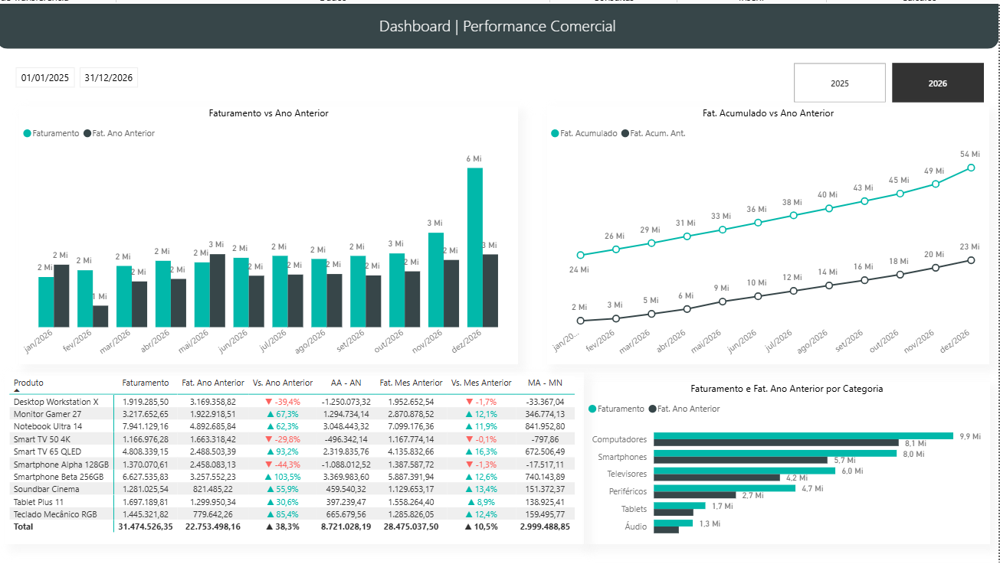

# 📊 Dashboard de Performance Comercial | Power BI

## 📌 Sobre o Projeto

Este projeto foi desenvolvido no **Power BI** com o objetivo de analisar a **performance comercial** da empresa por meio de indicadores estratégicos de faturamento, comparativos entre períodos e análises por produto e categoria.

O dashboard utiliza recursos de **Inteligência Temporal (Time Intelligence)** e medidas em **DAX** para comparar o desempenho do ano atual com o ano anterior, permitindo acompanhar a evolução das vendas e identificar tendências de crescimento ou queda.

---

## 🎯 Objetivos

- Monitorar a evolução do faturamento.
- Comparar o desempenho com o ano anterior.
- Analisar o faturamento acumulado ao longo do período.
- Avaliar a variação mensal e anual dos produtos.
- Identificar categorias com melhor desempenho.
- Apoiar a tomada de decisão através de indicadores estratégicos.

---

## 📈 Funcionalidades

- Comparativo de faturamento entre o ano atual e o ano anterior.
- Evolução do faturamento acumulado por período.
- Comparação do faturamento acumulado com o ano anterior.
- Análise da variação percentual em relação ao ano anterior (YoY).
- Análise da variação percentual em relação ao mês anterior (MoM).
- Ranking de produtos por faturamento.
- Comparativo de faturamento por categoria.
- Filtros dinâmicos por período e ano.

---

## 📊 Indicadores

O dashboard apresenta indicadores como:

- Faturamento Atual
- Faturamento do Ano Anterior
- Faturamento Acumulado
- Faturamento Acumulado do Ano Anterior
- Variação em relação ao Ano Anterior (%)
- Variação em relação ao Mês Anterior (%)
- Diferença absoluta entre períodos
- Evolução do faturamento por categoria

---

## 🛠️ Técnicas Utilizadas

Durante o desenvolvimento foram aplicados conceitos de:

- Modelagem de Dados
- Power Query
- DAX
- Time Intelligence
- Comparação entre Períodos
- KPIs
- Storytelling com Dados
- Visualização de Dados
- Boas práticas em Power BI

---

## 🧠 Recursos DAX Utilizados

O dashboard foi desenvolvido utilizando medidas em DAX para análise comparativa entre períodos, com destaque para funções de Inteligência Temporal (Time Intelligence), como:

- **CALCULATE** para modificar o contexto de filtro e construir medidas dinâmicas.
- **DATEADD** para comparar o desempenho entre períodos deslocados (mês anterior e ano anterior).
- **SAMEPERIODLASTYEAR** para análise de faturamento em relação ao mesmo período do ano anterior.
- Cálculo de Faturamento Acumulado (Running Total).
- Comparação entre o faturamento atual e o ano anterior (Year over Year - YoY).
- Comparação entre o faturamento atual e o mês anterior (Month over Month - MoM).
- Cálculo de diferenças absolutas e percentuais entre períodos.
- Atualização dinâmica dos indicadores conforme os filtros aplicados.

---

## 🎛️ Interatividade

O dashboard permite análises através de filtros como:

- Ano
- Intervalo de Datas

Todos os visuais são interativos, possibilitando explorar os dados de forma dinâmica.

---

## 📷 Dashboard

[]

---

## 🛠️ Técnicas Utilizadas

Durante o desenvolvimento foram aplicados conceitos de:

- Modelagem de Dados
- Power Query
- DAX
- Inteligência Temporal (Time Intelligence)
- Funções DAX como `CALCULATE`, `DATEADD` e `SAMEPERIODLASTYEAR`
- Comparação entre períodos (YoY e MoM)
- KPIs comerciais
- Storytelling com dados
- Visualização de dados
- Boas práticas em Power BI

---

## 🚀 Principais Aprendizados

Durante este projeto foi possível aprofundar conhecimentos em:

- Construção de KPIs comerciais.
- Desenvolvimento de medidas complexas em DAX.
- Inteligência Temporal (Time Intelligence).
- Comparação entre períodos.
- Análise de desempenho comercial.
- Desenvolvimento de dashboards executivos.
- Storytelling com dados para apoio à tomada de decisão.

## 📥 Instalação

Para clonar este repositório e acessar o projeto:

```bash
git clone https://github.com/rjunio98/dash-performance-comercial
cd dash-performance
```